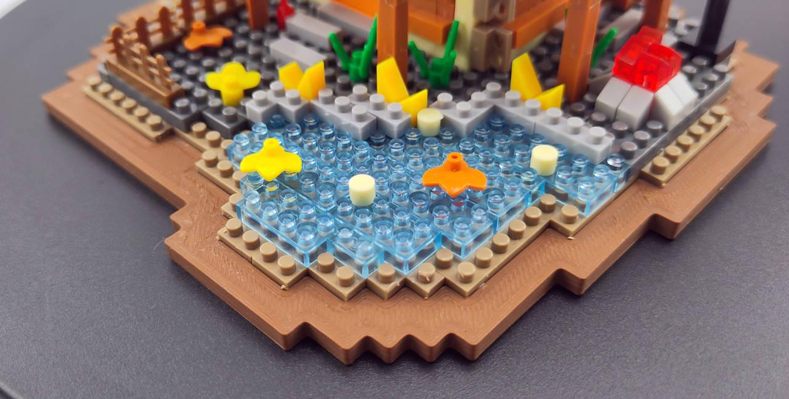
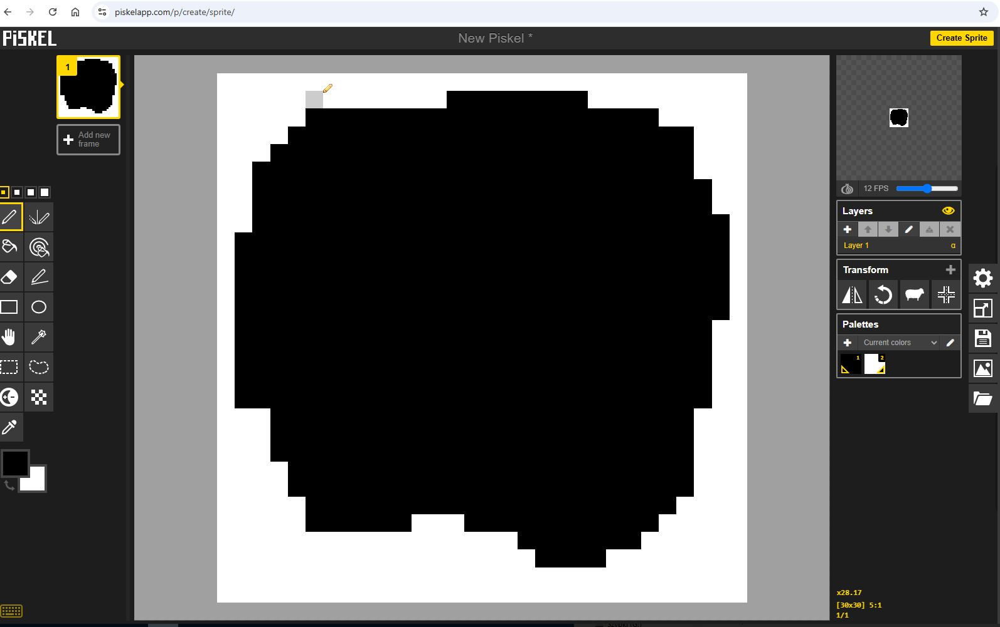
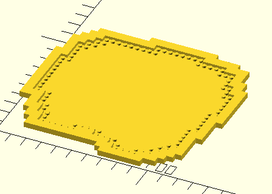

# Base Plate Outliner

This tool generates OpenSCAD scripts to render irregular-shaped baseplates based on PNG images.



## Overview

The script analyzes a reference PNG image to identify a shape (dark pixels = inside, light pixels = outside) of custom baseplate, then optimally decomposes the shape into rectangular baseplates and generates an OpenSCAD script to render them.

&nbsp;

## Installation

### Prerequisites

You need:
- Python 3 (version 3.6 or higher)
- Git (for cloning the repository and initializing submodules)
- OpenSCAD (for rendering the generated .scad files)

### Step 1: Clone the Repository and Initialize Submodules

**IMPORTANT:** This project uses the MachineBlocks library as a git submodule. You must initialize the submodule after cloning:

```bash
# Clone the repository
git clone https://github.com/dlvoy/base-plate-outliner
cd base-plate-outliner

# Initialize and update submodules
git submodule update --init --recursive
```

If you've already cloned the repository without the `--recursive` flag, you can initialize submodules later:

```bash
git submodule update --init --recursive
```

### Step 2: Set Up Python Environment

### Quick Setup (Recommended)

The easiest way to set up the project is to use the provided setup scripts:

**On Linux/Mac:**
```bash
./setup.sh
```

**On Windows:**
```bash
setup.bat
```

These scripts will automatically:
- Create a virtual environment
- Activate it
- Install all required dependencies

After running the setup script, the virtual environment will be activated and ready to use.

### Manual Setup

If you prefer to set up manually or if the automated script doesn't work:

It's highly recommended to use a Python virtual environment to isolate dependencies:

#### 1. Create a virtual environment

```bash
# Navigate to the project directory
cd /path/to/base-plate-outliner

# Create virtual environment
python3 -m venv .venv
```

#### 2. Activate the virtual environment

**On Linux/Mac:**
```bash
source .venv/bin/activate
```

**On Windows:**
```bash
.venv\Scripts\activate
```

You should see `(.venv)` appear at the beginning of your command prompt, indicating the virtual environment is active.

#### 3. Install Dependencies

With the virtual environment activated, install the required packages:

```bash
pip install -r requirements.txt
```

Or install manually:
```bash
pip install Pillow numpy
```

#### 4. Deactivate when done (optional)

When you're finished working with the script, you can deactivate the virtual environment:

```bash
deactivate
```

**Note:** You'll need to activate the virtual environment (step 2) each time you open a new terminal session to use the script.

## Usage

**Important:** Make sure to activate your virtual environment before running the script:
```bash
source .venv/bin/activate  # On Linux/Mac
# OR: .venv\Scripts\activate  # On Windows
```

### Basic Usage

```bash
python3 generate_irregular_baseplate.py [image] [options...]
```

If no `image` is specified, it defaults to `image.png`. The output filename is automatically derived from the input image name (e.g., `my_shape.png` → `my_shape.scad`).

### Options

- `image` - Path to input PNG image (default: `image.png`)
- `-o, --output` - Path to output OpenSCAD file (default: derived from input image name, e.g., `image.png` → `image.scad`). 

  > **Important**: If the output file is in a different directory than the script's main directory, the `use` and `include` directives in the generated .scad file will use relative paths that may not correctly point to the `machineblocks/` library. In such cases, you must either install MachineBlocks globally in OpenSCAD, or manually adjust the paths in the generated file to ensure OpenSCAD can find the library

- `--edge [THICKNESS]` - Only generate baseplates on the edge of the shape with specified thickness in brick units (default: 1 if no value given). Interior is filled with solid cubes for efficiency. Value must be >= 1

- `--border [THICKNESS_MM]` - Add a border around the outside edge of the shape with specified thickness in millimeters (default: 5mm if no value given). Border is created using solid cubes positioned precisely in mm. Value must be != 0 (unless using --frame mode)

- `--borderHeightAdjust ADJUST_MM` - Adjust the height of the border/frame in millimeters (default: 0). This adjustment is added to the standard baseplate height (without studs). Can be positive (taller) or negative (shorter), but the final height must be > 0 (base height is 3.2mm)

- `--frame` - Frame mode: Creates a filled rectangular border that encloses the entire shape. In this mode, `--border` specifies the padding (in mm) between the shape's bounding rectangle and the outer frame edge. Padding can be 0 for no gap. The frame fills the area between the shape edges and the outer rectangle

- `--config CONFIG_PATH` - Path to OpenSCAD config file (default: `machineblocks/config/config-default.scad`). The script reads `unitMbu`, `unitGrid`, and `scale` values from this file to calculate brick dimensions. This ensures consistency between the Python script and the generated OpenSCAD output. For Nanoblocks (half-size bricks), use `configs/config-nano.scad`

- `--center` - Center the generated model around X and Y axes. When enabled, the entire model (including baseplates, borders, and frames) is wrapped in a single `translate()` operation that positions the model's center at the origin (0,0). This is useful for 3D printing or when you want the model centered on the build plate

- `-t, --threshold` - Grayscale threshold (0-255). Pixels darker than this value are considered "inside" the shape (default: 128)

- `--debug` - Enable debug mode: each baseplate gets a random color with varying hue (useful for visualizing individual baseplates)

### Examples

```bash
# Specify custom image (generates my_shape.scad)
python3 generate_irregular_baseplate.py my_shape.png

# Edge mode: only 1 brick unit thick edge with baseplates, rest filled with cubes
python3 generate_irregular_baseplate.py my_shape.png --edge

# Border with custom 3.2mm thickness
python3 generate_irregular_baseplate.py my_shape.png --border=3.2

# Border with height adjustment (+2.5mm taller)
python3 generate_irregular_baseplate.py my_shape.png --border --borderHeightAdjust=2.5

# Border with negative adjustment (-1.5mm shorter, final height = 1.7mm)
python3 generate_irregular_baseplate.py my_shape.png --border --borderHeightAdjust=-1.5

# Frame mode with 5mm padding between shape and frame
python3 generate_irregular_baseplate.py my_shape.png --frame --border=5

# Generate baseplates for Nanoblocks (half-size bricks)
python3 generate_irregular_baseplate.py my_shape.png --config=configs/config-nano.scad

# Center the model at origin (useful for 3D printing)
python3 generate_irregular_baseplate.py my_shape.png --center

# Combine multiple options: centered model with border
python3 generate_irregular_baseplate.py my_shape.png --border=3.2 --center
```

More examples can be found in [usage guidelines](./docs/USAGE.md#examples)

Also check out the [Sample Renderings Gallery](./docs/GALLERY.md) to see visual examples of all available features and modes!

## Usage Guidelines

- In project `docs` there is detailed description of [modes](./docs/FEATURES.md#modes) and custom nano block [config](./docs/FEATURES.md#configurations)
- Take a look into [usage guidelines](./docs/USAGE.md) in `docs` folder
- There is also [tutorial on creating custom baseplate](./docs/TUTORIAL.md)
- Browse the [visual gallery](./docs/GALLERY.md) to see rendered examples of all features
- Documentation also describes [technical details](./docs/TECHNICAL.md) of used algorithm

## About MachineBlocks

This project uses the [MachineBlocks](https://github.com/pks5/machineblocks) library, which is a comprehensive OpenSCAD library for creating big-L compatible bricks and components. MachineBlocks provides:

- Parametric brick generation
- Support for various brick types (standard, Technic, plates, etc.)
- Customizable dimensions and features
- Professional-quality 3D-printable models

The MachineBlocks library is included as a git submodule in the `machineblocks/` directory. The generated OpenSCAD scripts reference:
- `machineblocks/lib/block.scad` - Main library file
- `machineblocks/config/config-default.scad` - Default configuration

For more information about MachineBlocks, visit: https://machineblocks.com/

## License

This script is [licensed](./LICENSE) under MIT, provided as-is for use with the MachineBlocks library. 

```
Copyright (c) 2025 Dominik Dzienia <dominik.dzienia@gmail.com>
MIT License
https://opensource.org/license/MIT
```


The MachineBlocks library itself is:

```
Copyright (c) 2022 - 2025 Jan Philipp Knoeller <pk@pksoftware.de>
Creative Commons Attribution-NonCommercial-ShareAlike 4.0 International
https://creativecommons.org/licenses/by-nc-sa/4.0/
```
