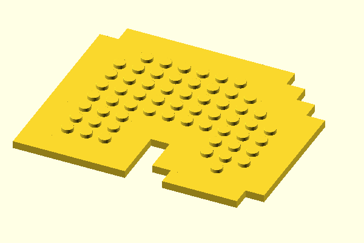
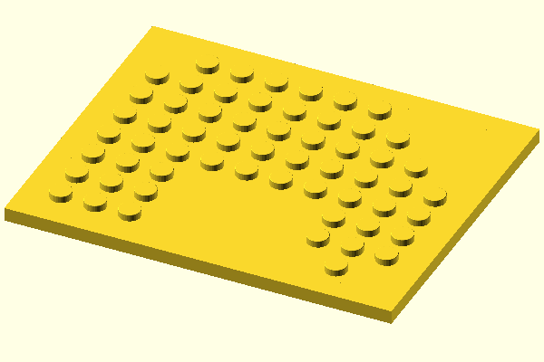

# Advanced Features

**Visual Examples**: Want to see what these features look like? Check out the [Sample Renderings Gallery](./GALLERY.md) for rendered images of all modes and configurations!

## Modes

### Edge Mode (`--edge`)


Edge mode generates baseplates only on the perimeter of the shape, filling the interior with solid cubes for material efficiency:

- **Thickness**: Specified in brick units (1 brick unit = 8mm for standard bricks, depending on config)
- **Algorithm**: Uses morphological erosion with 8-connectivity to ensure uniform thickness in all directions (horizontal, vertical, and diagonal)
- **Interior Fill**: Automatically fills the interior with optimized cubes (sized in brick units)
- **Use Case**: Ideal for large shapes where a solid interior saves printing time and material while maintaining structural strength at the edges

### Border Mode (`--border`)



Border mode adds a precise millimeter-based border around the outside of your shape:

- **Precision**: Border thickness and positioning use exact millimeter measurements (not constrained to brick units)
- **Complete Coverage**: Creates borders on all 8 directions - top, bottom, left, right, and all 4 diagonal corners - ensuring complete perimeter coverage
- **Algorithm**: Creates border rectangles on each edge and corner of the shape, then merges adjacent rectangles to minimize the number of cubes
- **Height Control**: Border height defaults to baseplate height (without studs) but can be adjusted with `--borderHeightAdjust`
- **Independence**: Border dimensions are completely independent of the brick grid system
- **Use Case**: Perfect for creating frames, mounting flanges, or custom-sized perimeters around your baseplate

### Frame Mode (`--frame`)



Frame mode creates a filled rectangular border that encloses the entire shape (requires `--border` to be specified):

- **Rectangular Enclosure**: Creates a frame around the bounding rectangle of the entire shape, not just following the shape's edges
- **Padding Control**: The `--border` value specifies padding (in mm) between the shape's bounding box and the outer frame edge. Can be 0 for no gap
- **Area Filling**: Fills the entire rectangular area between the shape edges and the outer frame boundary
- **Precision**: Uses exact millimeter measurements with 0.1mm resolution for optimal rectangle decomposition
- **Algorithm**: Identifies the shape's bounding box, expands it by the padding amount, then fills the area between the shape and expanded rectangle using optimized cube decomposition
- **Height Control**: Frame height works the same as border mode - defaults to baseplate height but can be adjusted with `--borderHeightAdjust`
- **Use Case**: Ideal for creating mounting plates, enclosures, or providing a flat rectangular base for irregular shapes

**Difference from Border Mode:**
- **Border**: Follows the shape's edges closely, creating a border that matches the shape's outline
- **Frame**: Creates a rectangular enclosure around the shape's bounding box, filling gaps to form a complete rectangle

### Centering (`--center`)

The `--center` option centers the entire generated model around the X and Y axes:

- **Single Transform**: Wraps all generated elements (baseplates, borders, frames) in a single `translate()` operation
- **Origin Position**: Places the model's center at (0, 0) in OpenSCAD coordinates
- **Automatic Calculation**: Intelligently calculates the bounding box including borders/frames when present
- **Use Case**: Ideal for 3D printing (centers model on build plate), rotating models, or creating symmetrical assemblies

**How It Works:**
- Without borders/frames: Centers based on the image dimensions
- With borders/frames: Calculates the bounding box of all border/frame elements for accurate centering

**Examples:**
- `--center`: Center a simple baseplate design
- `--border=5 --center`: Center a design with border
- `--frame --border=3 --center`: Center a design with rectangular frame

### Combining Modes

You can combine multiple modes to create complex structures:
- Baseplates on the edge (with studs for connectivity)
- Solid interior fill (for material efficiency)
- Precise mm-based border/frame around the outside (for custom mounting or framing)
- Centered positioning for easy printing or assembly

**Examples:**
- `--edge=2 --border=5`: Edge baseplates + border following shape outline
- `--edge=2 --frame --border=3`: Edge baseplates + rectangular frame with 3mm padding
- `--border=5 --center`: Centered design with border
- `--edge=2 --frame --border=3 --center`: Centered edge baseplates with rectangular frame

## Configurations

By default, script uses machineblocks configuration for standard sized blocks.

You may need [calibrate your setup](https://machineblocks.com/docs/calibration)

### Nanoblocks Configuration

The project includes a configuration file for generating Nanoblocks, which are half-size versions of standard bricks:

- **Config File**: `configs/config-nano.scad`
- **Scale**: 0.5 (half the size of standard bricks)
- **Unit Size**: 4mm per brick unit (compared to 8mm for standard bricks)
- **Usage**: Specify the config file with `--config=configs/config-nano.scad`

**Key Differences from Standard Bricks:**
- **Dimensions**: All measurements are halved (unitMbu = 1.6mm, unitGrid = [5, 2], scale = 0.5)
- **Compatibility**: Designed for Nanoblock-compatible brick systems
- **Image Interpretation**: Each pixel in your input image still represents one brick unit, but the physical size will be 4mm × 4mm instead of 8mm × 8mm
- **Border/Frame**: All mm-based measurements (--border, --borderHeightAdjust) remain in millimeters and are not affected by the scale

**Example:**
```bash
# Generate Nanoblock baseplates from a 20×20 pixel image
# Result: 80mm × 80mm baseplate (20 pixels × 4mm per Nanoblock unit)
python3 generate_irregular_baseplate.py my_shape.png --config=configs/config-nano.scad

# Nanoblocks with frame
python3 generate_irregular_baseplate.py my_shape.png --config=configs/config-nano.scad --frame --border=2
```
