# Sample Renderings Gallery

This gallery showcases various rendering options and configurations using the sample image [test-12x12.png](./../tests/test-12x12.png).

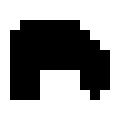

Each example demonstrates different features and command-line options available in the Base Plate Outliner script. All examples use the `--center` option to position the model at the origin for better visualization.


## Default Baseplate

These examples show the basic baseplate generation without any special modes. The script analyzes the input image and generates an optimized arrangement of rectangular baseplates that match the shape. The default configuration uses standard-sized bricks where each pixel represents one 8mm × 8mm brick unit.

### Standard rendering with centered model

```bash
python3 generate_irregular_baseplate.py ./test-12x12.png --center
```

This command generates a centered baseplate with the default yellow color. The model consists of optimally decomposed rectangular baseplates that cover the entire shape defined in the input image.

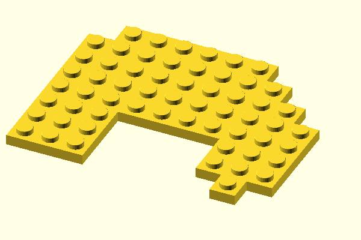

### Debug mode with random colors

```bash
python3 generate_irregular_baseplate.py ./test-12x12.png --center --debug -o ./test-12x12-debug.scad
```

Debug mode assigns a random color to each individual baseplate while maintaining the same saturation and lightness. This visualization helps you understand how the greedy rectangle decomposition algorithm breaks down the shape and makes it easier to identify individual baseplate components.

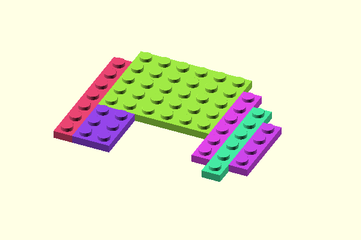

## Edge Mode

Edge mode generates baseplates only around the perimeter of the shape while filling the interior with solid cubes. This approach is more efficient for larger shapes, saving material and printing time while maintaining structural integrity and allowing bricks to connect at the edges where studs are present.

### Edge with 1 brick unit thickness

```bash
python3 generate_irregular_baseplate.py ./test-12x12.png --center --edge -o ./test-12x12-edge=1.scad
```

This command creates a single brick unit thick edge around the shape. The algorithm uses morphological erosion with 8-connectivity to ensure uniform thickness in all directions, including diagonals. The interior is filled with optimized cube arrangements.

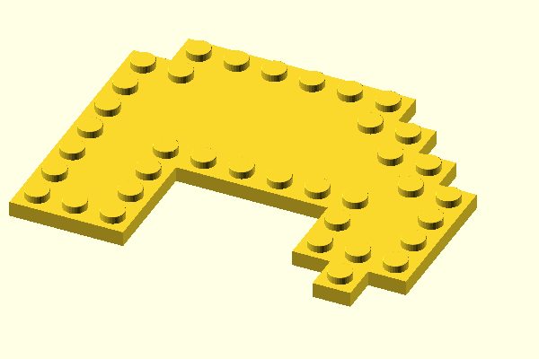

### Edge with 2 brick units thickness

```bash
python3 generate_irregular_baseplate.py ./test-12x12.png --center --edge=2 -o ./test-12x12-edge=2.scad
```

Increasing the edge thickness to 2 brick units provides more area with studs for brick connections while still maintaining an efficient solid interior. This configuration offers a good balance between connectivity and material efficiency.

> For such a small test shape - center without studs is rather small :)


## Border Mode

Border mode adds a precise millimeter-based border around the outside of the shape. Unlike the brick-based baseplates, borders use exact millimeter measurements and are created using solid cubes positioned with sub-millimeter precision. This feature is ideal for creating mounting flanges, frames, or custom perimeters.

### Default border with 5mm thickness

```bash
python3 generate_irregular_baseplate.py ./test-12x12.png --center --border -o ./test-12x12-border.scad
```

The default border thickness is 5mm. The border follows the contours of the shape closely, creating a uniform border around all edges. The border height matches the baseplate height (without studs) by default.

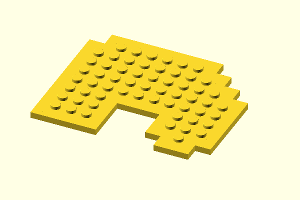

### Thin border with 2mm thickness

```bash
python3 generate_irregular_baseplate.py ./test-12x12.png --center --border=2 -o ./test-12x12-border=2.scad
```

A 2mm border creates a subtle, thin outline around the shape. This is useful when you need minimal additional structure or want to add just a small mounting edge.

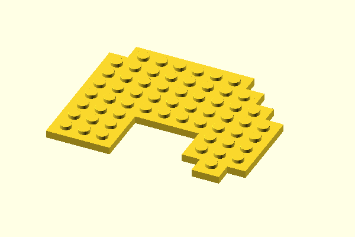

### Wide border with 12mm thickness

```bash
python3 generate_irregular_baseplate.py ./test-12x12.png --center --border=12 -o ./test-12x12-border=12.scad
```

A 12mm border creates a substantial frame around the shape. This wider border provides more material for mounting holes, additional structural support, or aesthetic purposes.

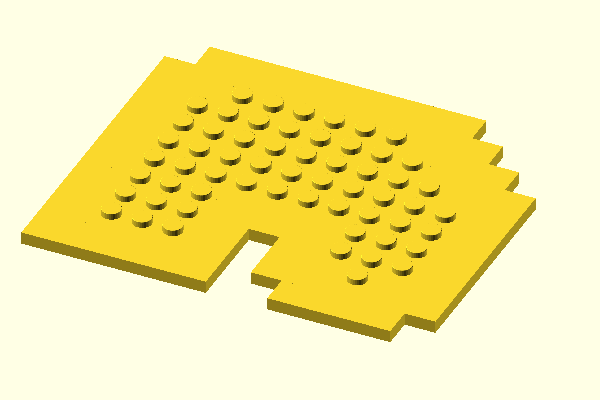

## Sunken and Raised Borders

The `--borderHeightAdjust` option allows you to modify the border height relative to the standard baseplate height. Negative values create sunken borders (lower than the baseplate), while positive values create raised borders (higher than the baseplate). This feature enables creating recessed mounting surfaces or elevated frames.

### Sunken border (2mm lower than baseplate)

```bash
python3 generate_irregular_baseplate.py ./test-12x12.png --center --border --borderHeightAdjust=-2 -o ./test-12x12-border,borderHeightAdjust=-2.scad
```

This creates a border that sits 2mm below the top surface of the baseplate. The sunken border can serve as a recess for mounting components or creating multi-level structures. The base height is 3.2mm, so a -2mm adjustment results in a 1.2mm tall border.

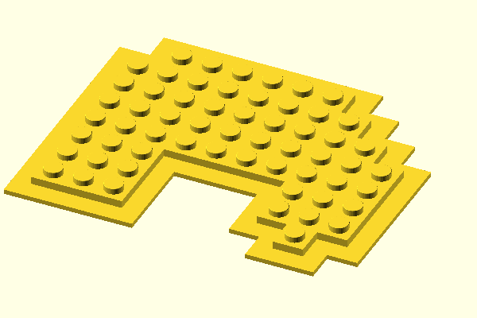

### Slightly sunken border (1mm lower than baseplate)

```bash
python3 generate_irregular_baseplate.py ./test-12x12.png --center --border --borderHeightAdjust=-1 -o ./test-12x12-border,borderHeightAdjust=-1.scad
```

A more subtle 1mm sunken border creates a slight recess while maintaining most of the border height. This results in a 2.2mm tall border, useful for subtle multi-level designs.

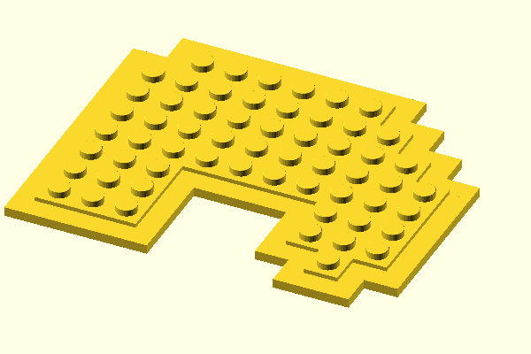

### Raised border (2mm higher than baseplate)

```bash
python3 generate_irregular_baseplate.py ./test-12x12.png --center --border --borderHeightAdjust=2 -o ./test-12x12-border,borderHeightAdjust=2.scad
```

A raised border extends 2mm above the baseplate surface, creating a protective rim or elevated mounting surface. The total border height becomes 5.2mm (3.2mm base + 2mm adjustment). When using positive adjustments, the script automatically creates a two-layer design with an inset top layer to provide clearance for bricks stacked on the baseplate.

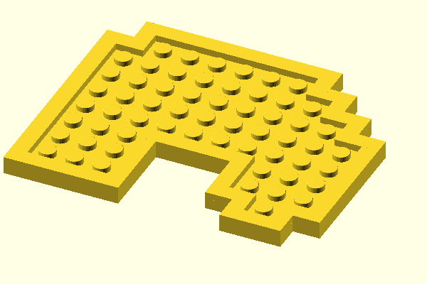

## Frame Mode

Frame mode creates a filled rectangular border that encloses the entire shape, rather than following its contours. The frame forms a complete rectangular outline around the shape's bounding box, filling all gaps to create a solid rectangular base. The `--border` value in frame mode specifies the padding distance between the shape's edges and the outer frame boundary.

### Default frame with 5mm padding

```bash
python3 generate_irregular_baseplate.py ./test-12x12.png --center --border --frame -o ./test-12x12-border,frame.scad
```

This creates a rectangular frame with 5mm of padding between the shape's bounding rectangle and the outer frame edge. The frame fills the entire rectangular area, creating a solid mounting plate or base for the irregular shape.

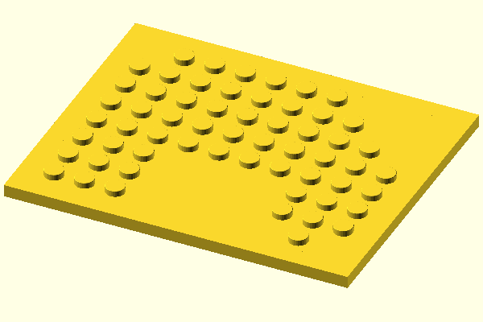

### Tight frame with no padding

```bash
python3 generate_irregular_baseplate.py ./test-12x12.png --center --border=0 --frame -o ./test-12x12-border=0,frame.scad
```

Setting the padding to 0mm creates a frame that touches the shape's bounding rectangle directly, with no gap. This creates the most compact rectangular enclosure possible while still filling all irregular edges to form a complete rectangle.

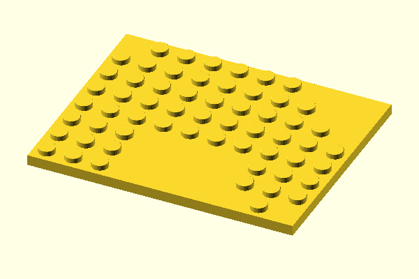

### Wide frame with 10mm padding

```bash
python3 generate_irregular_baseplate.py ./test-12x12.png --center --border=10 --frame -o ./test-12x12-border=10,frame.scad
```

A 10mm padding creates substantial space between the shape and the frame's outer boundary. This is useful for creating mounting plates with ample room around the shape for screws, brackets, or other attachments.

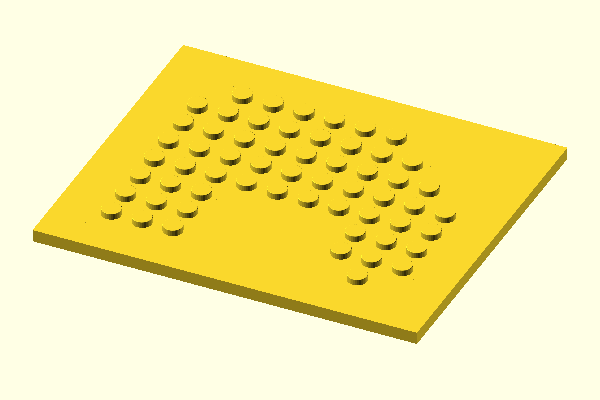

## Sunken Frame

Combining frame mode with height adjustments creates recessed rectangular bases. This is particularly useful for creating mounting plates where the baseplate sits flush or recessed relative to the frame edge.

### Sunken frame with 10mm padding

```bash
python3 generate_irregular_baseplate.py ./test-12x12.png --center --border=10 --borderHeightAdjust=-1.5 --frame -o ./test-12x12-border=10,borderHeightAdjust=1.5,frame.scad
```

This creates a rectangular frame with 10mm padding where the frame is 1.5mm lower than the baseplate surface. The recessed frame creates a mounting surface that sits below the level of the baseplates, useful for creating flush-mounted assemblies or protective borders that don't interfere with bricks placed on the baseplate.

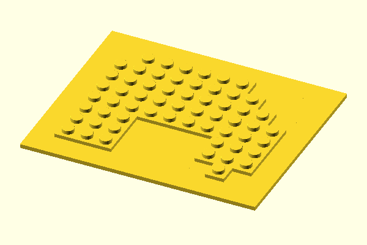


## Learn More
- [Usage Guidelines](./USAGE.md) - Detailed command-line options and examples
- [Advanced Features](./FEATURES.md) - In-depth explanation of modes and configurations
- [Tutorial](./TUTORIAL.md) - Step-by-step guide to creating your own custom baseplate
- [README](../README.md) - Installation and quick start guide