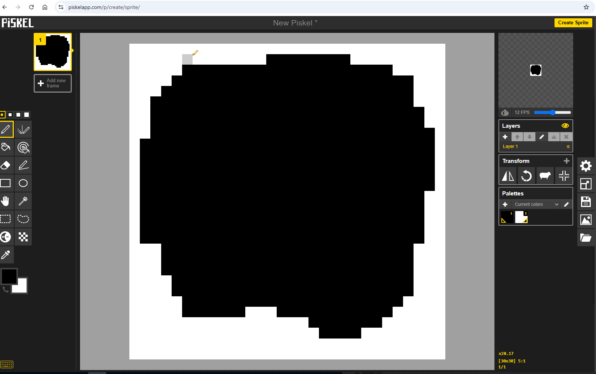
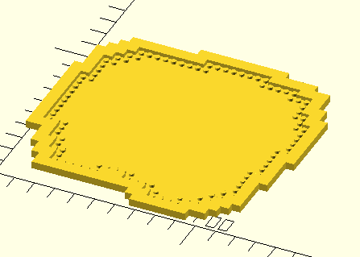

# Tutorial - Creating a Custom Baseplate for Nano Blocks Wood Cabin Model


This tutorial will walk you through the complete process of creating a custom irregular-shaped baseplate for your building blocks model. 

We'll use a nano blocks wood cabin as our example, but you can apply these same techniques to any model you want to create a custom base for.

## 0. Setup and Preparation

Before we begin creating our custom baseplate, we need to set up the tool and ensure our 3D printer is properly calibrated.

First, follow the installation instructions detailed in the [README](../README.md) to get the tool installed on your system. Make sure you've cloned the repository with the `--recursive` flag to include the MachineBlocks submodule, and that you've installed all Python dependencies.

Once installed, remember to activate your Python virtual environment every time you use the tool. You can do this by running:

**On Linux/Mac:**
```bash
source .venv/bin/activate
```

**On Windows:**
```bash
.venv\Scripts\activate
```

> **Important calibration note:** If this is the first time you're printing building blocks on your 3D printer, you'll need to calibrate your printer setup first to ensure proper fit and dimensions. Visit the [MachineBlocks calibration guide](https://machineblocks.com/docs/calibration) to learn how to test and adjust your printer settings for optimal results.

## 1. Draw the Model Shape

In this step, we'll create a digital template that represents the shape of our model's base. This template will be used to generate the custom baseplate.

Start by carefully examining the outline of your model. Look at it from above and identify the overall shape that the baseplate needs to cover. For our example, we're working with a nano blocks cabin model:


Next, you'll need to draw this shape using a drawing program. The best choice is a program that supports pixel art mode, where each pixel represents exactly one brick unit. If you don't have a preferred drawing program, you can use the free online tool Piskel App: https://www.piskelapp.com/p/create/sprite/

When drawing your shape, fill in the area where you want the baseplate to be with black or dark colors. Everything outside this area should be white or light colored. Here's what our cabin shape looks like when drawn:

  

**Important tips for drawing:**
- Leave at least 1 pixel of white border around the edges of your canvas. This ensures the shape detection works correctly.
- Make sure your sprite/canvas size matches the dimensions you need. Each pixel in your image will correspond to one brick unit (4mm × 4mm for nanoblocks, 8mm × 8mm for standard blocks).

  

  When you're satisfied with your drawing, export it as a PNG image file. Make sure to export only a single frame if your drawing program supports animation:

  


## 2. Generate the OpenSCAD Script

Now that we have our shape drawn and saved as a PNG file, we'll use the Python script to analyze the image and generate an OpenSCAD file. This OpenSCAD file will contain all the instructions needed to render our custom baseplate in 3D.

For our nano blocks cabin example, we want to create a baseplate with a raised border around the edge. This border will be **6mm** wide and positioned **2mm** above the base level, creating a nice "sunken" effect where the model sits slightly recessed into the baseplate.

Open your terminal, make sure your virtual environment is activated, navigate to the project directory, and run the following command:

```bash
$ python3 generate_irregular_baseplate.py ./tests/chatka-z-jeziorem.png -o ./chatka.scad --edge --border=6 --borderHeightAdjust=2 --config=./configs/config-nano.scad
```

Let's break down what each parameter does:
- `./tests/chatka-z-jeziorem.png` - The path to our input PNG image
- `-o ./chatka.scad` - The output filename for our generated OpenSCAD script
- `--edge` - Generates baseplates only on the edge (1 brick unit thick by default), filling the interior with solid cubes for material efficiency
- `--border=6` - Creates a 6mm wide border around the outside of the baseplate
- `--borderHeightAdjust=2` - Raises the border 2mm above the baseplate level, creating the "sunken" effect
- `--config=./configs/config-nano.scad` - Uses the nano blocks configuration (4mm brick units instead of standard 8mm)

When you run this command, the script will analyze your image and generate the OpenSCAD file. You'll see output similar to this:

```
Using config: ./configs/config-nano.scad
  unitMbu = 1.6, unitGrid = [5.0, 2.0], scale = 0.5
  Calculated unit size: 4.0mm
Loading image: ./tests/chatka-z-jeziorem.png
Image size: 30x30 pixels
Pixels inside shape: 621

Decomposing shape into rectangles...
Edge mode enabled: edge thickness = 1 brick units
Edge pixels: 108
Interior pixels: 513

Border mode enabled: border thickness = 6.0mm
Generated 45 border rectangles (base layer)
Generating top layer with 0.1mm inset for clearance
Generated 45 border rectangles (top layer)

Generating OpenSCAD script...
OpenSCAD script generated: ./chatka.scad
Total baseplates: 28
Total brick units covered by baseplates: 108

Baseplate sizes used:
  1x2: 6 plates
  1x3: 5 plates
  5x1: 3 plates
  1x6: 3 plates
  1x1: 2 plates
  3x1: 2 plates
  2x1: 2 plates
  8x1: 1 plates
  9x1: 1 plates
  1x5: 1 plates
  1x10: 1 plates
  4x1: 1 plates

Total interior cubes: 15
Total brick units covered by interior: 513

Interior cube sizes used:
  5x1: 2 cubes
  6x22: 1 cubes
  8x21: 1 cubes
  4x22: 1 cubes
  1x19: 1 cubes
  2x19: 1 cubes
  1x16: 1 cubes
  1x12: 1 cubes
  1x11: 1 cubes
  1x4: 1 cubes
  1x8: 1 cubes
  1x1: 1 cubes
  4x1: 1 cubes
  2x1: 1 cubes

Total border cubes: 45
Border thickness: 6.0mm, Height adjustment: 2.0mm
Total area covered by border: 2832.00 mm²

Border cube sizes used (in mm):
  2.00x4.00mm: 6 cubes
  6.00x4.00mm: 5 cubes
  4.00x10.00mm: 5 cubes
  4.00x14.00mm: 3 cubes
  2.00x8.00mm: 3 cubes
  16.00x6.00mm: 2 cubes
  8.00x6.00mm: 2 cubes
  6.00x12.00mm: 2 cubes
  4.00x26.00mm: 2 cubes
  44.00x6.00mm: 1 cubes
  32.00x6.00mm: 1 cubes
  2.00x26.00mm: 1 cubes
  2.00x10.00mm: 1 cubes
  2.00x68.00mm: 1 cubes
  2.00x22.00mm: 1 cubes
  4.00x36.00mm: 1 cubes
  4.00x52.00mm: 1 cubes
  2.00x50.00mm: 1 cubes
  2.00x20.00mm: 1 cubes
  12.00x10.00mm: 1 cubes
  24.00x6.00mm: 1 cubes
  12.00x6.00mm: 1 cubes
  6.00x10.00mm: 1 cubes
  2.00x6.00mm: 1 cubes

Done!
```

The script provides detailed statistics about what it generated, including the number of baseplates, interior cubes, and border sections. This information helps you understand the complexity of your design and what to expect when it renders.

## 3. Load the Model into OpenSCAD

Now we'll open the generated .scad file in OpenSCAD to visualize our custom baseplate in 3D.

Launch OpenSCAD and open the generated .scad file (in our example, `chatka.scad`). OpenSCAD will begin processing the file and generating a preview. This process can take some time, especially for complex shapes, so be patient.


While you're waiting for the preview to load, here's a useful tip: if you want to see the individual components that make up your baseplate (the edge baseplates, interior fill, and border sections), you can regenerate the .scad file using the `--debug` flag. This adds random colors to each component, making it easy to visualize how the baseplate is constructed:

```bash
$ python3 generate_irregular_baseplate.py ./tests/chatka-z-jeziorem.png -o ./chatka.scad --edge --border=6 --borderHeightAdjust=2 --config=./configs/config-nano.scad --debug
```

Once the preview loads, carefully examine the model to make sure it looks correct. Check that the shape matches your expectations, the border is in the right place, and everything aligns properly.

## 4. Render the Final Model

After verifying that the preview looks good, it's time to render the final high-quality 3D model.

In OpenSCAD, go to the menu and select **Design → Render** (or press `F6` on your keyboard). This initiates the rendering process, which converts your design into a solid 3D mesh.



**Be prepared to wait!** Rendering can take considerably longer than the preview, especially for complex baseplates with many components. The rendering process is computationally intensive, but it's necessary to create a proper 3D model file for printing. You can monitor the progress in OpenSCAD's console window.

## 5. Export to 3MF Format

Once rendering is complete, we need to export the model in a format that your 3D printer slicer can understand.

In OpenSCAD, go to **File → Export → Export as 3MF** and save the file with a descriptive name.

> **Important:** Always use the **3MF** format for exporting, not STL. While STL is an older and more widely known format, 3MF is a modern replacement that offers better quality, smaller file sizes, and additional features. All modern slicers support 3MF format, so there's no reason to use the outdated STL format anymore.

## 6. Slice and Print on Your 3D Printer

Now we're ready to prepare the model for actual 3D printing using your slicer software.

Open the exported 3MF file in your preferred slicer software (such as PrusaSlicer, Cura, OrcaSlicer, or BambuStudio). The default settings of a 0.4mm nozzle and 0.2mm layer height work perfectly fine for printing baseplates and will give you good quality results.


However, for improved strength and durability, consider adjusting these settings:

**Increase the number of perimeters:** Change from the default 2 perimeters to 4. This creates thicker walls and makes your baseplate much stronger and more rigid:


**Change the infill pattern:** Switch from the default rectilinear pattern to gyroid. Gyroid infill provides excellent strength with good material efficiency and looks nice if your baseplate has any hollow areas:


After adjusting your settings, slice the model and send it to your 3D printer. 

For material, **PLA** filament works great and is the recommended choice. It prints easily, doesn't warp, and provides plenty of strength for baseplates. While other materials like **PETG** or **ABS/ASA** will also work, they tend to warp more during printing, which can affect the flatness and fit of your baseplate.

Any standard FDM/FFF 3D printer will work fine for this project. If you have access to a resin printer, that will work even better and produce exceptionally smooth results!


## 7. Enjoy Your Custom Baseplate!

Congratulations! Once your print is complete, remove it from the print bed and clean off any support material or brim if needed.

Take a moment to inspect your custom baseplate and admire the quality of the print:


Now test-fit your model on the baseplate to verify that everything aligns correctly. The building blocks should snap securely into the studs, and the model should sit nicely within the raised border:


> **Troubleshooting fit issues:** Depending on your printer settings and calibration, the printed baseplate may not be dimensionally accurate. If your model doesn't fit easily or the blocks feel too tight, you should [perform calibration](https://machineblocks.com/docs/calibration) first. After calibrating, you can also increase the `baseSideAdjustment` value in `configs/config-nano.scad` to add more clearance between the studs and blocks.

If everything fits perfectly, go ahead and assemble your model on its new custom baseplate. You now have a professional-looking display base that's perfectly sized for your creation:


You can now display your model with pride, knowing it has a custom-made foundation that fits it perfectly. This same process can be used to create custom baseplates for any building block model you can imagine!

